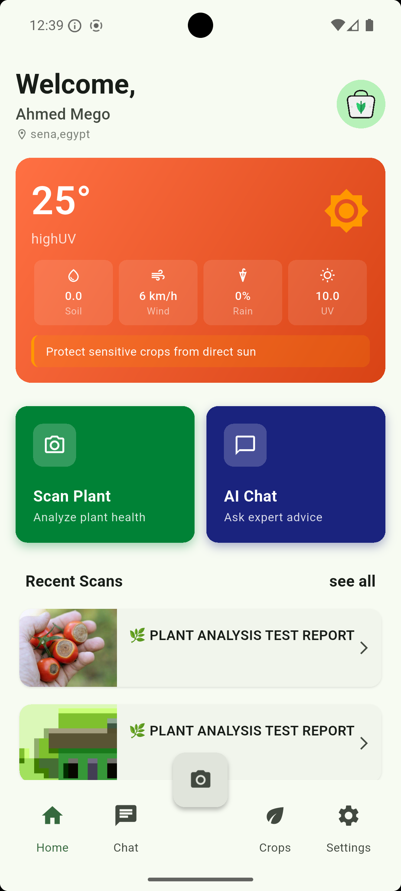
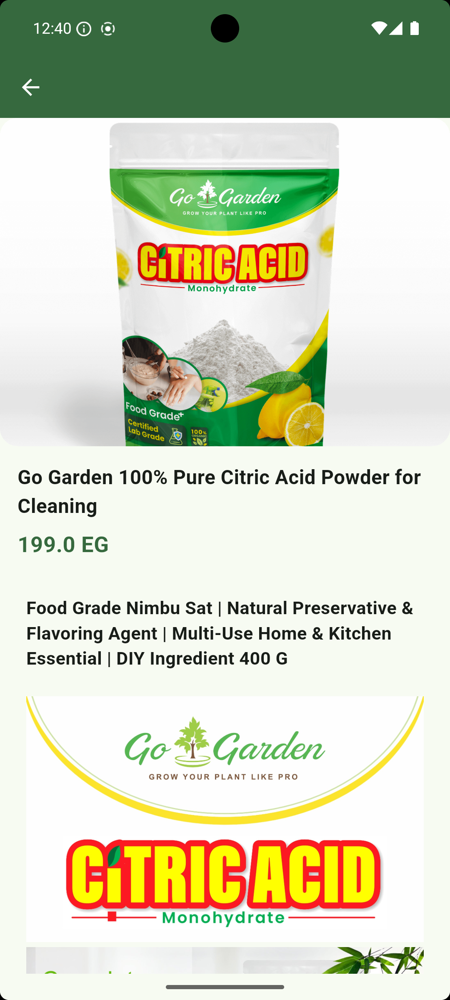

# 🌱 Agri Guide — Flutter Agricultural Marketplace App

A production-ready Flutter application that connects farmers and agricultural 
enthusiasts with essential farming products. Built with Clean Architecture, 
Bloc/Cubit state management, and REST API integration using Dio.

> ⚡ Built to demonstrate real-world Flutter development practices: 
> scalable structure, clean separation of concerns, and robust API handling.

---

## 📱 Screenshots

<!-- Add 3 screenshots here after recording -->
| Home Screen |Market| Product Details | Product Details 2 |
|---|---|---|
|  | | |  | 

---

## ✅ Key Features

- 🛒 **Product Marketplace** — Browse fertilizers, tools, seeds with full detail views
- 🔍 **Smart Search & Filter** — Search by name or category in real time
- 🌐 **REST API Integration** — Live product data via Dio with full error handling
- 🏗️ **Clean Architecture** — Feature-first structure, fully scalable
- ⚙️ **Bloc / Cubit** — Predictable, testable state management throughout

---

## 🛠️ Tech Stack

| Layer | Technology |
|---|---|
| Framework | Flutter (Dart) |
| State Management | Bloc / Cubit |
| Networking | Dio |
| Architecture | Clean Architecture (Feature-first) |
| Error Handling | Custom API error handling layer |

---

## 🏗️ Project Structure